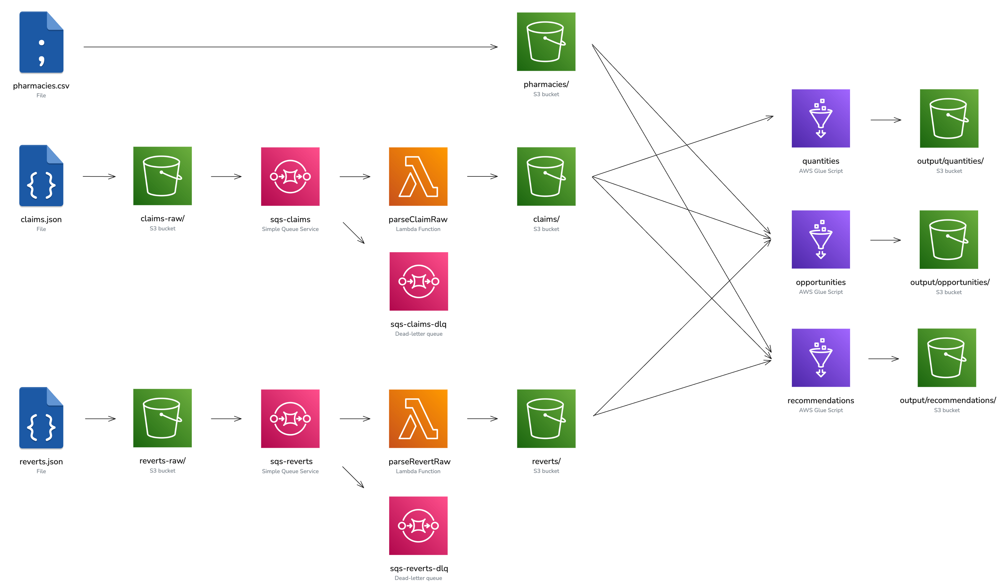

## Amazon Pipeline

### Amazon S3

Amazon S3 is an object storage service that stores data as objects within buckets. In this project, it stores raw data, processed objects, and output files generated by AWS Glue.

### Amazon SQS

Amazon SQS is a distributed message queue that enables applications to queue and process messages asynchronously. Here, an event is queued whenever a new object is created in the S3 raw data folders. Additionally, we use dead-letter queues to capture events that could not be processed successfully.

### AWS Lambda

AWS Lambda is a serverless computing service that allows you to run code without managing servers. A Lambda function is triggered in this pipeline for each JSON added to the raw folders.

### AWS Glue

AWS Glue is a serverless data integration service that simplifies discovering, preparing, moving, and integrating data. Three different jobs are defined in Glue to answer specific business questions. The resulting JSON objects are then placed in the designated S3 output folder.

### Solution Diagram

